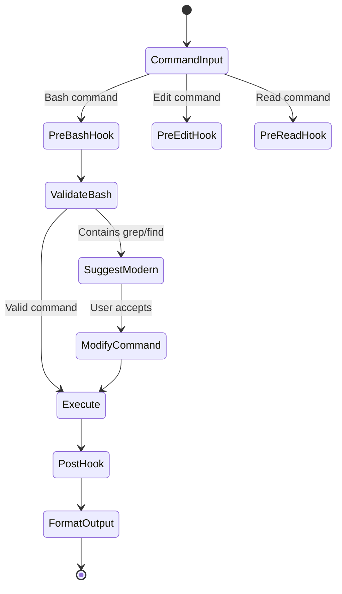

# SuperClaude + Claude Code Native Integration Architecture v3.0
*Practical Implementation for Personal Developer Workflow*

## Executive Summary

This architecture integrates SuperClaude's advanced command patterns into Claude Code's native slash commands and hooks system. Designed for personal use and dotfiles integration, it focuses on practical developer productivity with deterministic behavior.

## Core Design Principles

### 1. Native Claude Code Integration
- Use Claude Code's built-in slash command format
- Leverage native hooks system for deterministic behavior
- No external dependencies or complex infrastructure

### 2. Dotfiles-Friendly Structure
- Everything in `~/.claude/` for easy version control
- Simple shell scripts and markdown files
- Compatible with `dotfiles add` workflow

### 3. Modern Tool Usage
- `rg` (ripgrep) for all content searches
- `fd` (fd-find) for all file operations
- `biome` and `ruff` for code formatting

## System Architecture

### Directory Structure

```
~/.claude/
├── commands/                    # Native slash commands
│   ├── analyze.md              # Code analysis and insights
│   ├── build.md                # Smart build orchestration
│   ├── test.md                 # Intelligent test execution
│   ├── chain.md                # Command composition
│   ├── search.md               # Advanced search with rg
│   ├── find.md                 # File finding with fd
│   ├── refactor.md             # Code refactoring assistance
│   ├── debug.md                # Debugging helper
│   ├── document.md             # Documentation generation
│   ├── review.md               # Code review assistance
│   ├── optimize.md             # Performance optimization
│   ├── security.md             # Security analysis
│   ├── migrate.md              # Code migration helper
│   ├── scaffold.md             # Project scaffolding
│   ├── clean.md                # Code cleanup
│   ├── deploy.md               # Deployment assistance
│   ├── monitor.md              # Monitoring setup
│   ├── backup.md               # Backup management
│   └── restore.md              # Restore operations
├── hooks/                      # Event-driven behavior
│   ├── pre-bash.sh            # Command validation & suggestions
│   ├── post-bash.sh           # Result formatting
│   ├── pre-edit.sh            # Edit validation
│   ├── post-edit.sh           # Auto-formatting with biome/ruff
│   ├── pre-read.sh            # Security checks
│   ├── git-commit-msg.sh     # Conventional commit generation
│   └── notification.sh        # Status notifications
├── lib/                        # Shared utilities
│   ├── patterns.sh            # Common rg patterns
│   ├── filters.sh             # fd filter presets
│   ├── validators.sh          # Input validation
│   └── formatters.sh          # Output formatting
├── config/                     # Configuration
│   ├── defaults.json          # Default command options
│   ├── patterns.json          # Search pattern library
│   └── hooks.json             # Hook configuration
└── settings.json              # Main Claude Code settings
```

## Command Architecture

### Command Flow

```mermaid
graph LR
    subgraph "User Input"
        CMD[/command args]
    end
    
    subgraph "Claude Code Processing"
        PARSE[Parse Command]
        LOAD[Load command.md]
        HOOK1[PreToolUse Hooks]
        EXEC[Execute Tools]
        HOOK2[PostToolUse Hooks]
    end
    
    subgraph "Output"
        RESULT[Formatted Result]
    end
    
    CMD --> PARSE
    PARSE --> LOAD
    LOAD --> HOOK1
    HOOK1 --> EXEC
    EXEC --> HOOK2
    HOOK2 --> RESULT
```

### Command Format

Each command is a Markdown file with YAML frontmatter:

```markdown
---
name: analyze
description: Analyze code structure and patterns
author: SuperClaude Integration
version: 1.0.0
parameters:
  - name: path
    description: Path to analyze
    required: true
  - name: pattern
    description: Specific pattern to look for
    required: false
  - name: depth
    description: Analysis depth
    default: "full"
tools:
  - Task
  - Grep
  - Read
---

# Analyze Command

Performs comprehensive code analysis using ripgrep for pattern matching and fd for file discovery.

## Usage

```
/analyze path=./src pattern="TODO|FIXME" depth=full
```

## Implementation

1. Use `fd` to discover all relevant files
2. Apply `rg` patterns for code analysis
3. Generate insights and recommendations
4. Format results with actionable items
```

## Hook System

### Hook Types and Events



### Key Hooks

#### 1. Pre-Bash Hook (`pre-bash.sh`)
```bash
#!/bin/bash
# Validates commands and suggests modern alternatives

if echo "$TOOL_INPUT" | grep -q '\bgrep\b'; then
    echo "💡 Suggestion: Use 'rg' (ripgrep) instead of grep for better performance"
    TOOL_INPUT=$(echo "$TOOL_INPUT" | sed 's/\bgrep\b/rg/g')
fi

if echo "$TOOL_INPUT" | grep -q '\bfind\b'; then
    echo "💡 Suggestion: Use 'fd' instead of find for better usability"
    # Convert common find patterns to fd
fi
```

#### 2. Post-Edit Hook (`post-edit.sh`)
```bash
#!/bin/bash
# Auto-format code after edits

case "$FILE_PATH" in
    *.py)
        ruff format "$FILE_PATH"
        ruff check --fix "$FILE_PATH"
        ;;
    *.js|*.ts|*.jsx|*.tsx)
        biome format --write "$FILE_PATH"
        biome check --apply "$FILE_PATH"
        ;;
esac
```

#### 3. Git Commit Message Hook (`git-commit-msg.sh`)
```bash
#!/bin/bash
# Generates conventional commits with gitmoji

# Get staged changes
DIFF=$(git diff --cached)

# Create prompt for Claude
PROMPT="Generate commit messages in the Conventional Commits format, including a gitmoji, type, scope, and description.

The format should be:
<gitmoji> <type>(scope): <description>

Followed by a body with more details.

Use the following types and their corresponding gitmojis:
- feat: ✨ (new feature)
- fix: 🐛 (bug fix)
- docs: 📝 (documentation changes)
- style: 🧹 (code style changes)
- refactor: ♻️ (code refactoring)
- test: ✅ (adding tests)
- chore: 🚧 (other changes, e.g., build, CI)

Based on these changes:
$DIFF"

# Call Claude to generate commit message
claude-code ask "$PROMPT" > .git/COMMIT_EDITMSG
```

## Advanced Features

### 1. Smart Search Patterns

```json
{
  "patterns": {
    "security": {
      "secrets": "(?i)(api[_-]?key|secret|token|password|pwd|auth)\\s*[:=]\\s*['\"][^'\"]+['\"]",
      "vulnerabilities": "eval\\(|exec\\(|system\\(|shell_exec\\(",
      "sql_injection": "\\$_(GET|POST|REQUEST).*\\bquery\\b"
    },
    "performance": {
      "n_plus_one": "\\.each.*\\.where|\\.map.*\\.find",
      "memory_leak": "addEventListener(?!.*removeEventListener)",
      "inefficient_loop": "for.*in.*Object\\.keys"
    },
    "code_quality": {
      "todo": "TODO|FIXME|HACK|XXX|BUG",
      "console_log": "console\\.(log|debug|info|warn|error)",
      "commented_code": "^\\s*//.*[{};]\\s*$"
    }
  }
}
```

### 2. Command Chaining

```mermaid
graph LR
    subgraph "Chain Command"
        INPUT[/chain "analyze && test && build"]
        PARSE[Parse Chain]
        
        subgraph "Execution"
            CMD1[/analyze]
            CMD2[/test]
            CMD3[/build]
        end
        
        CACHE[Context Cache]
    end
    
    INPUT --> PARSE
    PARSE --> CMD1
    CMD1 --> CACHE
    CACHE --> CMD2
    CMD2 --> CACHE
    CACHE --> CMD3
```

### 3. Context Preservation

Commands can share context through Claude Code's memory system:

```markdown
---
name: chain
description: Execute multiple commands with shared context
context: preserve
---

Chains multiple commands together, preserving context between executions for intelligent workflow automation.
```

## Performance Optimizations

### 1. Intelligent Caching

```bash
# Cache rg results for repeated searches
CACHE_DIR="$HOME/.claude/cache"
CACHE_KEY=$(echo "$RG_ARGS" | sha256sum | cut -d' ' -f1)
CACHE_FILE="$CACHE_DIR/$CACHE_KEY"

if [ -f "$CACHE_FILE" ] && [ $(find "$CACHE_FILE" -mmin -5) ]; then
    cat "$CACHE_FILE"
else
    rg $RG_ARGS | tee "$CACHE_FILE"
fi
```

### 2. Parallel Execution

```bash
# Run multiple fd/rg commands in parallel
fd -t f -e py | parallel -j+0 rg -H "import.*unused" {}
```

## Git Integration Workflow

### Setup for Dotfiles

```bash
# First, ensure cache directory is ignored
echo ".claude/cache/" >> ~/.gitignore
echo ".claude/*.log" >> ~/.gitignore
dotfiles add .gitignore
dotfiles commit -m "🔧 chore: Ignore Claude cache and logs"

# Initial setup (works from any directory)
dotfiles add .claude/
dotfiles commit -m "✨ feat: Add Claude Code native commands and hooks"
dotfiles push

# After updates
dotfiles add .claude/commands/*.md .claude/hooks/*.sh
dotfiles commit -m "♻️ refactor: Update command patterns"
dotfiles push
```

### Per-Repository Hooks

```bash
# Option 1: Link hook for current repository
ln -s ~/.claude/hooks/git-commit-msg.sh .git/hooks/prepare-commit-msg

# Option 2: Use globally for all repositories
git config --global core.hooksPath ~/.claude/hooks

# Note: This applies to all git repos, not the dotfiles bare repo
```

## Implementation Plan

### Week 1: Core Commands
1. Implement basic commands (analyze, build, test, chain)
2. Set up hook infrastructure
3. Create pattern library

### Week 2: Advanced Commands
1. Add remaining 15 commands
2. Implement smart search patterns
3. Add context preservation

### Week 3: Integration & Testing
1. Git commit message generation
2. Performance optimizations
3. Documentation and examples

### Week 4: Polish & Release
1. Dotfiles integration guide
2. Example workflows
3. Community patterns

## Success Metrics

1. **Usability**: Commands feel native to Claude Code
2. **Performance**: Sub-second response for most operations
3. **Reliability**: Deterministic behavior through hooks
4. **Integration**: Seamless dotfiles workflow

## Example Workflows

### 1. Code Review Workflow
```bash
/analyze path=./src pattern="code_quality"
/test --affected
/review --changes
/chain "analyze && test && review"
```

### 2. Refactoring Workflow
```bash
/find name="*.py" --deprecated
/refactor pattern="old_api" replacement="new_api"
/test --affected
/document --updated
```

### 3. Security Audit
```bash
/security scan=full
/find pattern="secrets"
/analyze pattern="vulnerabilities"
```

## Conclusion

This architecture provides a practical, powerful integration of SuperClaude's capabilities into Claude Code's native ecosystem. By focusing on simplicity, modern tools, and dotfiles compatibility, it creates a sustainable personal development environment that enhances productivity without complexity.

*Version 3.0 - Focused on Native Claude Code Features*
*"Simple tools, intelligently applied"*