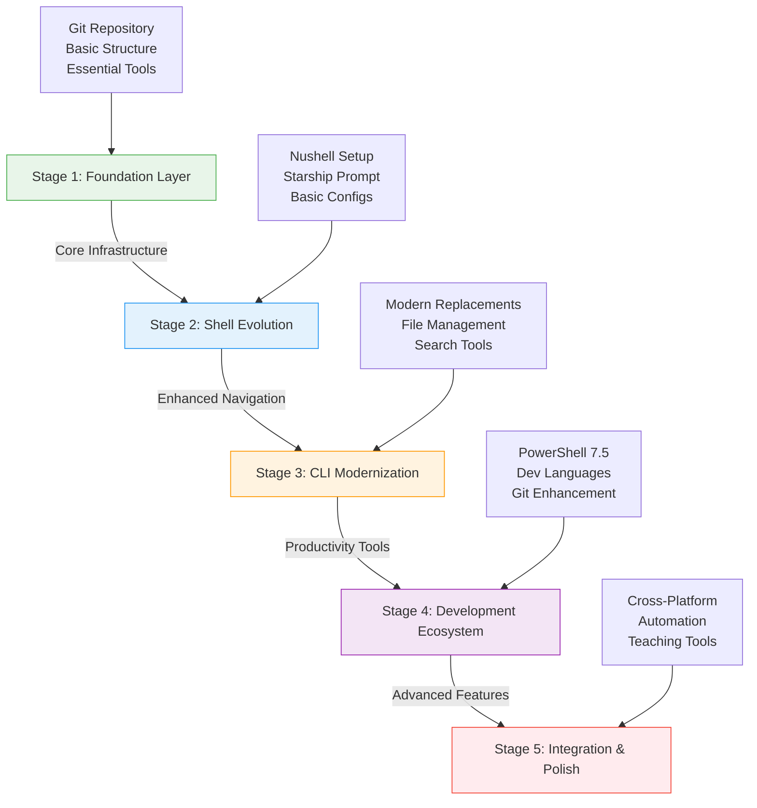

## Implementation Roadmap: Visual Architecture



## Stage-by-Stage Implementation Matrix

| Stage | Focus Area | Duration | Key Deliverables | Dependencies | Complexity |
|-------|------------|----------|------------------|--------------|------------|
| **1** | Foundation Layer | 2-3 hours | • Git repository structure<br/>• Universal installer script<br/>• Basic tool detection | None | ⭐⭐ |
| **2** | Shell Evolution | 3-4 hours | • Nushell configuration<br/>• Starship prompt<br/>• Shell switching logic | Stage 1 | ⭐⭐⭐ |
| **3** | CLI Modernization | 2-3 hours | • Rust tool installation<br/>• Modern CLI aliases<br/>• Integration scripts | Stage 2 | ⭐⭐⭐ |
| **4** | Development Ecosystem | 4-5 hours | • PowerShell setup<br/>• Language managers<br/>• Enhanced Git config | Stage 3 | ⭐⭐⭐⭐ |
| **5** | Integration & Polish | 3-4 hours | • Cross-platform testing<br/>• Automation scripts<br/>• Documentation | Stage 4 | ⭐⭐⭐⭐⭐ |


## Progressive Capability Evolution
```mermaid
graph LR
    subgraph "Current State"
        T1[Termux-Only]
        T2[Bash-Centric]
        T3[Manual Setup]
    end
    
    subgraph "Stage 1"
        S1A[Multi-Platform Base]
        S1B[Version Control]
        S1C[Automated Detection]
    end
    
    subgraph "Stage 2"
        S2A[Modern Shell]
        S2B[Unified Prompt]
        S2C[Smart Configs]
    end
    
    subgraph "Stage 3"
        S3A[Enhanced Tools]
        S3B[Rust Ecosystem]
        S3C[Productivity Boost]
    end
    
    subgraph "Stage 4"
        S4A[Multi-Language]
        S4B[Dev Workflows]
        S4C[Pro Git Setup]
    end
    
    subgraph "Stage 5"
        S5A[Full Portability]
        S5B[Teaching Ready]
        S5C[Self-Maintaining]
    end
    
    T1 --> S1A
    T2 --> S1B
    T3 --> S1C
    
    S1A --> S2A --> S3A --> S4A --> S5A
    S1B --> S2B --> S3B --> S4B --> S5B
    S1C --> S2C --> S3C --> S4C --> S5C
    ```