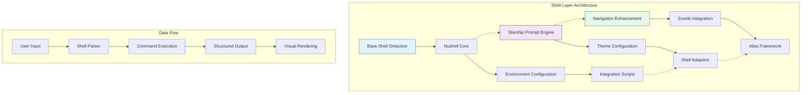
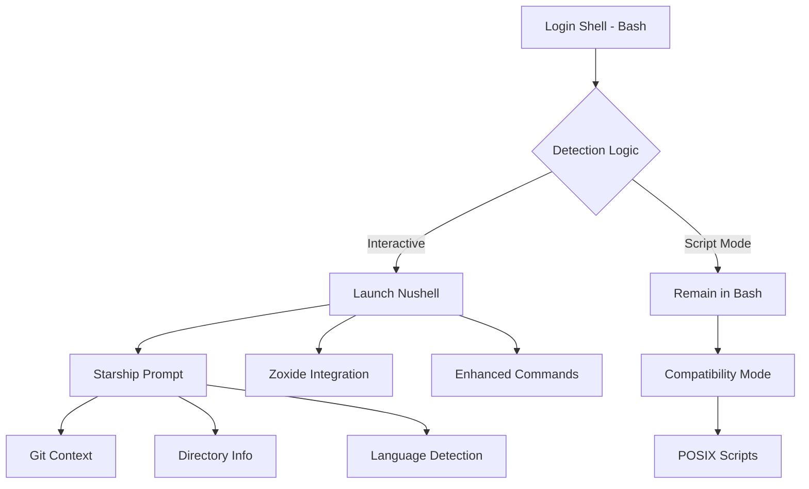

## Stage 2: Shell Evolution - Transforming the Command Line Experience

### Conceptual Framework: The Modern Shell Paradigm

#### Understanding Shell Evolution as a System Transformation

The transition from traditional shells to modern alternatives represents a fundamental shift in how we conceptualize human-computer interaction at the command line. This evolution encompasses three interconnected dimensions:

1. **Cognitive Load Optimization**: Modern shells reduce mental overhead through intelligent completions, structured data handling, and visual feedback mechanisms
2. **Data-Centric Operations**: Moving from text streams to structured data objects enables more intuitive manipulation and transformation
3. **Cross-Platform Harmonization**: Unified experiences across diverse environments reduce context-switching penalties

### Architectural Overview: Stage 2 Components



### Implementation Strategy: Progressive Enhancement Model

| Component | Purpose | Integration Points | Complexity Factor |
|-----------|---------|-------------------|-------------------|
| **Nushell Core** | Primary shell environment | System PATH, environment variables | Medium |
| **Starship Prompt** | Visual context system | All shells, Git integration | Low |
| **Zoxide Navigation** | Intelligent directory jumping | Shell history, frecency algorithm | Low |
| **Integration Layer** | Cross-shell compatibility | Bash/Zsh fallbacks, WSL support | High |

### Stage 2 Implementation: The Shell Evolution Script### Advanced Nushell Configuration: Structured Data Paradigm

Now let's create the enhanced Nushell configuration that leverages its unique capabilities:## Stage 2 Implementation: Practical Execution Framework

### Deployment Methodology: Sequential Integration Protocol

#### Pre-Installation Verification Checklist
Before executing Stage 2, ensure environmental readiness through systematic validation:

```bash
# Verify Stage 1 completion
cat ~/.dotfiles-stage  # Should display "1"

# Confirm repository structure
cd ~/dotfiles && tree -L 2

# Validate platform detection
source scripts/detect/platform.sh
echo "Platform: $(detect_os) | Package Manager: $(detect_pkg_manager)"
```

#### Installation Execution Sequence

1. **Script Preparation**
   ```bash
   cd ~/dotfiles
   # Save the Stage 2 installer as stage2-install.sh
   chmod +x stage2-install.sh
   ```

2. **Execution with Monitoring**
   ```bash
   # Run with real-time feedback
   ./stage2-install.sh | tee logs/stage2-install.log
   ```

3. **Post-Installation Activation**
   ```bash
   # Reload shell environment
   source ~/.bashrc
   
   # Test immediate functionality
   nu --version
   starship --version
   zoxide --version
   ```

### Component Integration Architecture

#### Shell Interaction Model
The relationship between shells creates a sophisticated hierarchy:



### Advanced Configuration Patterns

#### Nushell as a Data Processing Pipeline
Nushell's paradigm shift from text streams to structured data enables powerful workflows:

```nu
# Example: Analyze project structure
ls **/*.rs 
| where size > 10kb 
| sort-by modified --reverse
| first 10
| select name size modified
| to md
```

#### Starship Contextual Awareness
The prompt system provides real-time environmental feedback:

| Context | Visual Indicator | Information Provided |
|---------|-----------------|---------------------|
| Git Repository | Branch symbol + name | Current branch, modifications |
| Python Environment | 🐍 + version | Active interpreter |
| Node Project | ⬢ + version | Package.json detected |
| Rust Project | 🦀 + version | Cargo.toml present |
| SSH Session | hostname display | Remote connection indicator |

### Troubleshooting Matrix: Common Stage 2 Challenges

#### Platform-Specific Issues and Resolutions

**Termux Considerations:**
```bash
# If Rust installation fails due to space
df -h /data
# Solution: Use external storage
termux-setup-storage
export CARGO_HOME="/sdcard/cargo"
export RUSTUP_HOME="/sdcard/rustup"
```

**WSL2 Performance Optimization:**
```bash
# If compilation is slow
# Add to /etc/wsl.conf
[interop]
appendWindowsPath = false

[boot]
systemd = true
```

**Low-Memory Systems:**
```bash
# Reduce Rust compilation memory usage
export CARGO_BUILD_JOBS=1
export CARGO_INCREMENTAL=0
```

### Validation Framework: Comprehensive Testing Protocol

#### Functional Verification Suite
Execute these tests to confirm proper integration:

```bash
# Test 1: Shell transition
bash -c 'nu -c "print \"Transition successful\""'

# Test 2: Prompt rendering
starship prompt --status=$? --jobs=0

# Test 3: Navigation intelligence
cd /tmp && cd ~ && z tmp  # Should return to /tmp

# Test 4: Configuration persistence
nu -c 'open ~/.config/nushell/config.nu | lines | length'
```

#### Integration Quality Metrics

| Component | Success Criteria | Verification Command |
|-----------|-----------------|---------------------|
| Nushell | Starts without errors | `nu -c "sys \| get host"` |
| Starship | Renders in all shells | `echo $PROMPT_COMMAND` |
| Zoxide | Database creation | `ls ~/.local/share/zoxide/` |
| Configs | Files created | `ls -la ~/.config/{nushell,starship.toml}` |

### Optimization Strategies: Performance Enhancement

#### Shell Startup Time Reduction
Monitor and optimize initialization sequences:

```bash
# Measure Nushell startup
time nu -c "exit"

# Measure Bash with integrations
time bash -i -c "exit"

# Profile Starship performance
starship timings
```

#### Memory Footprint Management
For resource-constrained environments:

```nu
# In ~/.config/nushell/config.nu
$env.config = ($env.config | merge {
    history: {
        max_size: 1000  # Reduced from 10000
        file_format: "plaintext"  # Less memory than sqlite
    }
})
```

### Educational Integration: Teaching Considerations

Given your role as an educator, Stage 2 provides pedagogical opportunities:

#### Demonstration Scenarios
1. **Data Pipeline Concepts**: Use Nushell's structured data to teach functional programming
2. **Version Control Visualization**: Starship's git integration for repository state awareness
3. **Spatial Navigation**: Zoxide as an example of machine learning in CLI tools

#### Student Environment Simplification
Create a minimal configuration for students:

```bash
# ~/dotfiles/configs/student-minimal.nu
# Simplified Nushell config for teaching
alias ll = ls -l
alias cls = clear

def explain [command: string] {
    print $"Command: ($command)"
    help $command
}
```

### Future Trajectory: Preparing for Stage 3

#### Conceptual Preview
Stage 3 will introduce the modern CLI tool ecosystem, transforming common operations:

| Traditional Tool | Modern Replacement | Key Advantage |
|-----------------|-------------------|---------------|
| `cat` | `bat` | Syntax highlighting |
| `ls` | `exa` | Git integration |
| `find` | `fd` | Intuitive syntax |
| `grep` | `ripgrep` | Speed + gitignore |
| `sed` | `sd` | Readable syntax |

#### Pre-Stage 3 Optimization
Prepare your environment for the next phase:

```bash
# Ensure Rust toolchain is optimized
rustup update
cargo install cargo-update

# Pre-download common dependencies
cargo install --locked cargo-cache
cargo cache --autoclean
```

### Conclusion: Stage 2 Synthesis

The shell evolution implemented in Stage 2 represents a fundamental paradigm shift in command-line interaction. By establishing Nushell as the primary interface, Starship as the visual context system, and Zoxide as the navigation enhancement layer, we've created a foundation that:

- **Reduces Cognitive Load**: Structured data and visual feedback minimize mental overhead
- **Enhances Discoverability**: Intelligent completions and clear prompts aid learning
- **Maintains Compatibility**: Seamless fallback to traditional shells when needed
- **Prepares for Growth**: Architecture supports incremental enhancement

The journey from traditional text-based shells to modern, data-aware environments mirrors your own transformation from project manager to educator—both transitions emphasize clarity, structure, and purposeful communication.